# NeoForm Runtime (NFRT)

This project implements a standalone commandline interface to create artifacts used to compile mods against Minecraft.
It is usually used as part of a Gradle plugin.

It uses data from the [NeoForm project](https://github.com/neoforged/NeoForm) to deobfuscate, merge and patch the
sources and finally recompile them.

Since it is used as part of the NeoForge toolchain, it extends NeoForm by adding direct support to
apply [NeoForge](https://github.com/neoforged/NeoForge) patches and produces the necessary artifacts to compile against
the NeoForge APIs.

You'll find the [latest releases](https://projects.neoforged.net/neoforged/neoformruntime) on the NeoForged Project
Listing.

## Usage

### run: Creating Minecraft Artifacts

This is the primary use of the NeoForm Runtime. For a given NeoForge or NeoForm version, it will build
an execution graph and allows the caller to retrieve various resulting artifacts from it.

Examples

```
# Produce NeoForge jars for 1.20.6

> nfrt run --dist joined --neoforge net.neoforged:neoforge:20.6.72-beta:userdev
No results requested. Available results: [compiled, clientResources, sources, serverResources]

> nfrt run --neoforge net.neoforged:neoforge:20.6.72-beta:userdev \
    --dist joined \
    --write-result=compiled:minecraft.jar \
    --write-result=clientResources:client-extra.jar \
    --write-result=sources:minecraft-sources.jar 

This produces the NeoForge userdev artifacts in build/

> nfrt run --neoform net.neoforged:neoform:1.20.6-20240429.153634@zip \
    --dist joined \
    --write-result=compiled:minecraft.jar \
    --write-result=clientResources:client-extra.jar \
    --write-result=sources:minecraft-sources.jar 

This produces the Vanilla artifacts in build/

```

| Option                              | Description                                                                                                                                                                                                                                             |
|-------------------------------------|---------------------------------------------------------------------------------------------------------------------------------------------------------------------------------------------------------------------------------------------------------|
| `--dist` [required]                 | Which distribution type to generate artifacts for. NeoForm defines these and usually `client`, `server` and `joined` are available.                                                                                                                     |
| `--binary-pipeline`                 | Produces artifacts without decompiling and recompiling Minecraft. Enabling this option 1) adds new nodes in the graph, and 2) swaps out the outputs that can be requested. Existing node outputs are not altered and can still be requested.            |
| `--neoforge=<gav>`                  | Pass the NeoForge artifact to use as `net.neoforged:neoforge:<version>`. When passing this, the NeoForm version is implied. It can still be overridden by passing `--neoform` as well. You can also pass a local file path.                             |
| `--neoform=<gav>`                   | Pass the NeoForm artifact to use as `net.neoforged:neoform:<version>@zip`, or a path to a local file.                                                                                                                                                   |
| `--write-result=<id>:<path>`        | This option can be passed multiple times. It tells NFRT to write a result of the execution graph to the given path, such as the recompiled Minecraft jar-file, or the sources. If you pass no such option, NFRT will print which results are available. |
| `--access-transformer=<path>`       | Adds access transformers which will be applied to the source before recompiling it.                                                                                                                                                                     |
| `--interface-injection-data=<path>` | Adds [interface injection data](https://github.com/neoforged/JavaSourceTransformer?tab=readme-ov-file#interface-injection) which will be applied to the source before recompiling it.                                                                   |
| `--repository=<uri>`                | Adds additional repositories that NFRT will use when it downloads artifacts. By default, the NeoForge repository and local Maven are used.                                                                                                              |
| `--launcher-meta-uri=<url>`         | Specifies a different URL to download the Launcher manifest from. The default is `https://launchermeta.mojang.com/mc/game/version_manifest_v2.json`                                                                                                     |                                                                                             |
| `--disable-cache`                   | Disables use of the intermediate result cache.                                                                                                                                                                                                          |
| `--print-graph`                     | Prints information about the execution graph used to create the artifacts.                                                                                                                                                                              |
| `--use-eclipse-compiler`            | When recompiling Minecraft sources, use the Eclipse compiler rather than javac. The Eclipse compiler is able to compile in parallel, while javac is single-threaded.                                                                                    |
| `--verbose`                         | Enables verbose output                                                                                                                                                                                                                                  |
| `--compile-classpath`               | Specify a classpath as you would with `-cp` for java, which is used to compile the sources. Without specifying this option, NFRT will automatically download the libraries used by Minecraft and NeoForm and use those as the compile classpath.        |

### download-assets: Download Minecraft Assets

The game needs a particular directory layout of its assets to run properly.
NFRT helps with this by downloading the assets required to run a particular version of the game.

```
# Download Assets for a specific version of Minecraft
nfrt download-assets --minecraft-version 1.20.6 --write-properties assets.properties

# Download Assets for the Minecraft version used by the given NeoForm version
nfrt download-assets --neoform net.neoforged:neoform:1.20.6-20240429.153634@zip --write-properties assets.properties

# Download Assets for the Minecraft version used by the given NeoForge version
nfrt download-assets --neoforge net.neoforged:neoforge:20.6.72-beta:userdev --write-properties assets.properties

# In all three cases, a properties file will be written to assets.properties containing the following,
# which can be used to pass the required command line arguments for starting a Minecraft client.
asset_index=16
assets_root=...path to assets...
```

While it may seem odd that NFRT supports passing NeoForm or NeoForge versions to this command, this is in service
of potential Gradle plugins never having to actually read and parse the NeoForm configuration file.

| Option                         | Description                                                                                                                                                                       |
|--------------------------------|-----------------------------------------------------------------------------------------------------------------------------------------------------------------------------------|
| `--asset-root`                 | Where to store the downloaded assets. Optional. Defaults to `<nfrt_home>/assets`, or a detected Launcher installation. Can also be set by environment variable `NFRT_ASSET_ROOT`. |
| `--asset-repository`           | The remote URL to download assets from. Optional. Defaults to https://resources.download.minecraft.net. Can also be set by environment variable `NFRT_ASSET_REPOSITORY`.          |
| `--no-copy-launcher-assets`    | Disables copying of local Minecraft Launcher assets, if using the asset root directly is disabled.                                                                                |
| `--no-use-launcher-asset-root` | Disables using a detected Minecraft Launcher installation directly to store the required assets.                                                                                  |
| `--concurrent-downloads`       | Limits the maximum number of concurrent downloads. Default is 25.                                                                                                                 |
| `--write-properties`           | Writes a property file to the given path that contains the asset index id (`asset_index`) and asset root path (`assets_root`) suitable for passing to Minecraft.                  |
| `--write-json`                 | Writes a JSON file to the given path that contains the asset index id (`asset_index`) and asset root path (`assets`) suitable for passing to Minecraft via a Neoform entrypoint.  |

## Common Options

These options affect all NFRT subcommands.

### Set NFRT Home Directory

The `--home-dir` option changes where NFRT stores its caches, intermediate working directories, assets, etc.

It defaults to `.neoformruntime` in your user directory on Windows and Mac OS X, and `.cache/neoformruntime` on Linux,
where it also respects `XDG_CACHE_DIR`.

### Change Temporary Working Directories

The `--work-dir` option changes where NFRT creates temporary working directories.
Defaults to the given home directory, otherwise.

### Adding Custom Launcher Directories

NFRT will try to reuse files found in Minecraft launcher directories. It will scan known locations to find installation
directories.
If you have moved your launcher, you can supply additional launcher directories using the `--launcher-dir` option.

### Artifact Resolution

NFRT comes with built-in Maven repositories for downloading required files.
To override these repositories, use the `--repository` option one or more times.
If you'd only like to add repositories instead of overriding them completely, you can use the `--add-repository` option.

When running NFRT through a tool like Gradle, it might be desired to externally inject all needed dependencies,
by redirecting them to the local Gradle artifact cache.
NFRT supports this use case by supporting an artifact manifest, which can be supplied using the `--artifact-manifest`
option.

This manifest is a Java properties file in ISO-8859-1 encoding, which uses a Maven coordinate as the key and the full
path for that artifact as the value. For example:

`com.google.guava\:guava\:32.1.2-jre=C\:\\path\\to\\file.jar`

If a specific version is not found in the manifest, NFRT will also check for an entry with the version `*` to support
dependency replacement scenarios.

To aid with detecting missing entries to fully cover all required artifacts, the `--warn-on-artifact-manifest-miss`
option enables warnings when an artifact is being looked up, but not found in the manifest.
NFRT will continue to download the artifact remotely in this case.

### Mojang Launcher Manifest

The full URL to the [Launcher version manifest](https://launchermeta.mojang.com/mc/game/version_manifest_v2.json) can be
overridden using `--launcher-meta-uri`.

### Output Settings

For more verbose output, pass `--verbose`.

To force the use of ANSI color on the console, pass `--color`, or `--no-color` to disable it. The `NO_COLOR` environment
variable is also respected.

The use of Emojis in console output can be toggled with `--emojis` and `--no-emojis`.

## Example Execution Graphs

### NeoForge, Parchment, ATs

```mermaid
%%{init: {"flowchart": {"htmlLabels": false}} }%%
flowchart LR
  downloadManifest[[downloadManifest]]
  downloadJson[[downloadJson]]
  downloadServer[[downloadServer]]
  downloadJson-->|versionManifest|downloadServer
  listLibraries[[listLibraries]]
  downloadJson-->|versionManifest|listLibraries
  downloadClient[[downloadClient]]
  downloadJson-->|versionManifest|downloadClient
  downloadClientMappings[[downloadClientMappings]]
  downloadJson-->|versionManifest|downloadClientMappings
  extractServer[[extractServer]]
  downloadServer-->|downloadServerOutput|extractServer
  downloadServer-->|input|extractServer
  stripClient[[stripClient]]
  downloadClient-->|input|stripClient
  mergeMappings[[mergeMappings]]
  downloadClientMappings-->|downloadClientMappingsOutput|mergeMappings
  downloadClientMappings-->|official|mergeMappings
  stripServer[[stripServer]]
  extractServer-->|input|stripServer
  merge[[merge]]
  stripServer-->|server|merge
  stripServer-->|stripServerOutput|merge
  stripClient-->|client|merge
  stripClient-->|stripClientOutput|merge
  rename[[rename]]
  merge-->|mergeOutput|rename
  merge-->|input|rename
  listLibraries-->|listLibrariesOutput|rename
  mergeMappings-->|mappings|rename
  listLibraries-->|libraries|rename
  mergeMappings-->|mergeMappingsOutput|rename
  decompile[[decompile]]
  listLibraries-->|libraries|decompile
  rename-->|input|decompile
  listLibraries-->|listLibrariesOutput|decompile
  rename-->|renameOutput|decompile
  inject[[inject]]
  decompile-->|input|inject
  patch[[patch]]
  inject-->|input|patch
  applyNeoforgePatches[[applyNeoforgePatches]]
  patch-->|input|applyNeoforgePatches
  transformSources[[transformSources]]
  listLibraries-->|libraries|transformSources
  applyNeoforgePatches-->|input|transformSources
  recompile[[recompile]]
  transformSources-->|sources|recompile
  downloadJson-->|versionManifest|recompile
  sourcesWithNeoForge[[sourcesWithNeoForge]]
  transformSources-->|input|sourcesWithNeoForge
  mergeWithSources[[mergeWithSources]]
  transformSources-->|sources|mergeWithSources
  recompile-->|classes|mergeWithSources
  compiledWithNeoForge[[compiledWithNeoForge]]
  recompile-->|input|compiledWithNeoForge
  sourcesAndCompiledWithNeoForge[[sourcesAndCompiledWithNeoForge]]
  sourcesWithNeoForge-->|sources|sourcesAndCompiledWithNeoForge
  compiledWithNeoForge-->|classes|sourcesAndCompiledWithNeoForge
  result-compiled("`**Result**
compiled`")
  recompile --o result-compiled
  result-clientResources("`**Result**
clientResources`")
  stripClient --o result-clientResources
  result-sources("`**Result**
sources`")
  transformSources --o result-sources
  result-compiledWithNeoForge("`**Result**
compiledWithNeoForge`")
  compiledWithNeoForge --o result-compiledWithNeoForge
  result-compiledWithSources("`**Result**
compiledWithSources`")
  mergeWithSources --o result-compiledWithSources
  result-serverResources("`**Result**
serverResources`")
  stripServer --o result-serverResources
  result-sourcesAndCompiledWithNeoForge("`**Result**
sourcesAndCompiledWithNeoForge`")
  sourcesAndCompiledWithNeoForge --o result-sourcesAndCompiledWithNeoForge
  result-sourcesWithNeoForge("`**Result**
sourcesWithNeoForge`")
  sourcesWithNeoForge --o result-sourcesWithNeoForge
```

